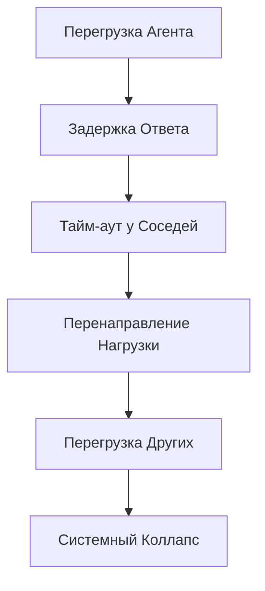

# Режимы Отказа и Восстановление AURA

## 1. Категоризация Режимов Отказа

### 1.1 По Критичности

| Уровень | Описание | Время Восстановления | Действие |
|---------|----------|---------------------|----------|
| **КРИТИЧЕСКИЙ** | Полный отказ системы | <1 минута | Автоматический перезапуск |
| **ВЫСОКИЙ** | Деградация >50% функций | <10 минут | Переключение на резерв |
| **СРЕДНИЙ** | Локальные сбои | <1 час | Изоляция и восстановление |
| **НИЗКИЙ** | Косметические проблемы | <24 часа | Планируемое исправление |

### 1.2 По Природе Сбоя

- **Структурные**: нарушение архитектуры
- **Динамические**: неустойчивость процессов
- **Эмерджентные**: непредсказуемое поведение
- **Ресурсные**: исчерпание ресурсов
- **Каскадные**: цепная реакция отказов

## 2. Конкретные Режимы Отказа

### 2.1 Потеря Иерархической Когерентности

#### Симптомы
```typescript
function detectCoherenceLoss(): boolean {
    const metrics = {
        inter_level_sync: 0.2,  // Норма >0.8
        consensus_rate: 0.1,    // Норма >0.7
        phi_integrated: 0.05     // Норма >0.3
    };

    const thresholds = {
        inter_level_sync: 0.8,
        consensus_rate: 0.7,
        phi_integrated: 0.3
    };

    return Object.entries(metrics).some(
        ([key, value]) => value < thresholds[key as keyof typeof thresholds]
    );
}
```

#### Признаки
- Уровни работают независимо друг от друга
- Нет передачи информации между масштабами
- Конфликтующие решения на разных уровнях
- Φ падает ниже критического значения 0.1

#### Причины
1. **Перегрузка каналов связи** (вероятность 40%)
2. **Рассинхронизация таймеров** (30%)
3. **Накопление ошибок округления** (20%)
4. **Внешние помехи** (10%)

#### Стратегия Восстановления
```typescript
class HierarchyRecovery {
  async recover(): Promise<void> {
    // Шаг 1: Заморозить все уровни
    await this.freezeAllLevels();

    // Шаг 2: Синхронизация часов
    await this.synchronizeClocks();

    // Шаг 3: Перезапуск с контрольной точки
    const checkpoint = await this.loadLastStableCheckpoint();

    // Шаг 4: Постепенная активация
    for (let level = 0; level < this.levels.length; level++) {
      await this.activateLevel(level);
      await this.waitForStabilization(level);
    }

    // Шаг 5: Валидация
    const phi = await this.measureIntegratedInfo();
    if (phi < 0.3) {
      throw new Error("Recovery failed");
    }
  }
}
```

#### Время восстановления: 30-120 секунд

### 2.2 Эмерджентный Хаос

#### Симптомы
- Экспоненциальный рост активности агентов
- Непредсказуемые осцилляции
- Фазовый переход в турбулентность

#### Метрики Детекции
| Метрика | Нормальное | Хаос | Измерение |
|---------|------------|------|-----------|
| Ляпуновский показатель | <0 | >0.5 | Расхождение траекторий |
| Энтропия | 0.3-0.7 | >0.95 | Шенноновская энтропия |
| Фрактальная размерность | 2-3 | >4 | Box-counting dimension |

#### Автоматическая Стабилизация
```typescript
function chaosDamping(): void {
    // Введение диссипации
    for (const agent of agents) {
        agent.energy *= 0.99;  // Демпфирование 1%
    }

    // Увеличение связности для синхронизации
    increaseCouplingStrength({ factor: 1.5 });

    // Введение глобального ингибирования
    const globalInhibition = calculateMeanActivity() * 0.1;
    broadcastInhibition(globalInhibition);
}
```

### 2.3 Застревание в Локальных Оптимумах

#### Признаки
- Отсутствие улучшения метрик >1000 итераций
- Циклическое поведение
- Все агенты в одинаковом состоянии

#### Механизм Выхода
```typescript
interface EscapeStrategy {
  simulated_annealing: {
    temperature: number;      // Начальная T = 1.0
    cooling_rate: 0.995;      // Геометрическое охлаждение
    noise_injection: true;
  };

  random_restart: {
    probability: 0.001;       // На каждой итерации
    preserve_best: 10%;      // Сохранить лучших агентов
  };

  diversity_injection: {
    mutation_rate: 0.05;
    crossover_rate: 0.1;
    immigration: 100;         // Новых агентов в поколение
  };
}
```

### 2.4 Комбинаторный Взрыв

#### Симптомы
- RAM usage >90%
- CPU 100% на всех ядрах
- Экспоненциальный рост времени отклика

#### Предотвращение
```typescript
class ComplexityLimiter {
    private static readonly MAX_AGENTS = 1e9;
    private static readonly MAX_CONNECTIONS_PER_AGENT = 1000;
    private static readonly MAX_HIERARCHY_DEPTH = 10;
    private static readonly MAX_COMPUTATION_TIME_MS = 5000;

    private agents: Agent[];
    private agentCount: number;

    constructor(agents: Agent[]) {
        this.agents = agents;
        this.agentCount = agents.length;
    }

    async enforceLimits(): Promise<any> {
        // Динамическое прореживание
        if (this.agentCount > ComplexityLimiter.MAX_AGENTS * 0.8) {
            this.pruneLeastActive(10);  // percent
        }

        // Ограничение связности
        for (const agent of this.agents) {
            if (agent.connections.length > ComplexityLimiter.MAX_CONNECTIONS_PER_AGENT) {
                agent.dropWeakestConnections();
            }
        }

        // Timeout на вычисления
        return await this.withTimeout(
            ComplexityLimiter.MAX_COMPUTATION_TIME_MS,
            () => this.compute()
        );
    }

    private pruneLeastActive(percent: number): void {
        // Реализация прореживания
    }

    private async withTimeout<T>(timeoutMs: number, operation: () => Promise<T>): Promise<T> {
        return Promise.race([
            operation(),
            new Promise<never>((_, reject) =>
                setTimeout(() => reject(new Error('Computation timeout')), timeoutMs)
            )
        ]);
    }

    private async compute(): Promise<any> {
        // Реализация вычислений
        return {};
    }
}
```

### 2.5 Декогеренция Квантовых Компонентов

#### Признаки
- Fidelity <0.5
- Энтропия запутанности →0
- Квантовое преимущество исчезает

#### Митигация
1. **Активная коррекция ошибок** (Shor code, Surface code)
2. **Динамическая декаплинг** (DD sequences)
3. **Fallback на классические алгоритмы**

```typescript
function quantumFallback(task: QuantumTask): QuantumResult {
    try {
        const result = quantumProcessor.execute(task, { shots: 1000 });
        if (result.fidelity > 0.7) {
            return result;
        }
    } catch (error) {
        if (error instanceof QuantumDecoherenceError) {
            // Продолжаем к классической эмуляции
        } else {
            throw error;
        }
    }

    // Классическая эмуляция
    return classicalSimulator.emulateQuantum(task);
}
```

## 3. Каскадные Отказы

### 3.1 Цепная Реакция



### 3.2 Прерывание Каскада

```typescript
class CascadeBreaker {
  private circuitBreakers: Map<string, CircuitBreaker> = new Map();

  async callWithProtection(
    serviceId: string,
    operation: () => Promise<any>
  ): Promise<any> {
    const breaker = this.getOrCreateBreaker(serviceId);

    if (breaker.isOpen()) {
      // Сервис недоступен, используем кэш или default
      return this.getFallbackResponse(serviceId);
    }

    try {
      const result = await operation();
      breaker.recordSuccess();
      return result;
    } catch (error) {
      breaker.recordFailure();

      if (breaker.shouldOpen()) {
        this.notifyCircuitOpen(serviceId);
        // Изоляция сбойного компонента
        await this.isolateService(serviceId);
      }

      throw error;
    }
  }
}
```

## 4. Мониторинг и Раннее Предупреждение

### 4.1 Ключевые Индикаторы

```typescript
interface IndicatorConfig {
    threshold: number;
    window: number;
}

interface Alert {
    name: string;
    value: number;
    severity: number;
}

class HealthStatus {
    constructor(public alerts: Alert[]) {}
}

class HealthMonitor {
    private indicators: Record<string, IndicatorConfig> = {
        'phi': { threshold: 0.2, window: 60 },
        'consensus_rate': { threshold: 0.5, window: 30 },
        'latency_p99': { threshold: 1000, window: 10 },
        'error_rate': { threshold: 0.01, window: 60 },
        'memory_usage': { threshold: 0.8, window: 5 },
        'agent_mortality': { threshold: 0.1, window: 300 }
    };

    checkHealth(): HealthStatus {
        const alerts: Alert[] = [];

        for (const [name, config] of Object.entries(this.indicators)) {
            const value = this.measure(name, config.window);
            if (value > config.threshold) {
                alerts.push({
                    name: name,
                    value: value,
                    severity: this.calculateSeverity(name, value)
                });
            }
        }

        return new HealthStatus(alerts);
    }

    private measure(name: string, window: number): number {
        // Реализация измерения метрики
        return 0;
    }

    private calculateSeverity(name: string, value: number): number {
        // Расчет серьезности
        return 1;
    }
}
```

### 4.2 Dashboard Реального Времени

```yaml
panels:
  - title: "System Health"
    metrics:
      - phi_integrated
      - agent_count
      - consensus_success_rate
    refresh: 1s

  - title: "Performance"
    metrics:
      - latency_histogram
      - throughput
      - error_rate
    refresh: 5s

  - title: "Resources"
    metrics:
      - cpu_usage
      - memory_usage
      - network_io
    refresh: 10s

alerts:
  - name: "Coherence Loss"
    condition: phi < 0.2 for 30s
    action: page_oncall

  - name: "Resource Exhaustion"
    condition: memory > 90% for 60s
    action: autoscale
```

## 5. Процедуры Восстановления

### 5.1 Автоматическое Восстановление

```typescript
type RecoveryStrategy = {
    name: string;
    successProbability: number;
    method: (failureType: FailureMode) => Promise<void>;
};

class RecoveryFailedException extends Error {}

enum FailureMode {
    COHERENCE_LOSS = 'coherence_loss',
    EMERGENT_CHAOS = 'emergent_chaos',
    LOCAL_OPTIMUM = 'local_optimum',
    RESOURCE_EXHAUSTION = 'resource_exhaustion'
}

class AutoRecovery {
    private strategies: RecoveryStrategy[] = [
        {
            name: 'restart_failed_agents',
            successProbability: 0.9,  // Простейшее
            method: this.restartFailedAgents.bind(this)
        },
        {
            name: 'rollback_to_checkpoint',
            successProbability: 0.7,  // Откат
            method: this.rollbackToCheckpoint.bind(this)
        },
        {
            name: 'reduce_load',
            successProbability: 0.5,  // Деградация
            method: this.reduceLoad.bind(this)
        },
        {
            name: 'isolate_and_rebuild',
            successProbability: 0.3,  // Изоляция
            method: this.isolateAndRebuild.bind(this)
        },
        {
            name: 'full_system_restart',
            successProbability: 0.1,  // Крайняя мера
            method: this.fullSystemRestart.bind(this)
        }
    ];

    async recover(failureType: FailureMode): Promise<boolean> {
        for (const strategy of this.strategies) {
            try {
                await strategy.method(failureType);

                // Валидация восстановления
                if (await this.validateRecovery()) {
                    this.logRecoverySuccess(strategy.name);
                    return true;
                }
            } catch (error) {
                if (error instanceof RecoveryFailedException) {
                    continue;
                }
                throw error;
            }
        }

        // Все стратегии провалились
        this.escalateToHuman();
        return false;
    }

    private async restartFailedAgents(failureType: FailureMode): Promise<void> {
        // Реализация перезапуска агентов
    }

    private async rollbackToCheckpoint(failureType: FailureMode): Promise<void> {
        // Реализация отката
    }

    private async reduceLoad(failureType: FailureMode): Promise<void> {
        // Реализация снижения нагрузки
    }

    private async isolateAndRebuild(failureType: FailureMode): Promise<void> {
        // Реализация изоляции и перестроения
    }

    private async fullSystemRestart(failureType: FailureMode): Promise<void> {
        // Реализация полного перезапуска
    }

    private async validateRecovery(): Promise<boolean> {
        // Проверка успешности восстановления
        return true;
    }

    private logRecoverySuccess(strategyName: string): void {
        console.log(`Recovery successful using strategy: ${strategyName}`);
    }

    private escalateToHuman(): void {
        console.log('All recovery strategies failed, escalating to human operators');
    }
}
```

### 5.2 Ручное Вмешательство

#### Когда Требуется
1. Автоматическое восстановление провалилось 3 раза
2. Обнаружено неизвестное поведение
3. Критические данные под угрозой
4. Требуется этическое решение

#### Инструменты для Операторов
```bash
# Экстренная остановка
aura emergency-stop --force

# Диагностика
aura diagnose --deep --export-state state.dump

# Хирургическое вмешательство
aura surgery --remove-agent <id> --preserve-connections

# Откат к стабильной версии
aura rollback --to-checkpoint <timestamp>

# Постепенный перезапуск
aura restart --gradual --monitor
```

## 6. Тестирование Устойчивости

### 6.1 Chaos Engineering

```typescript
interface ChaosTestResult {
    scenario: string;
    recoveryTime: number;
    dataLoss: number;
    passed: boolean;
}

class ChaosMonkey {
    private scenarios: string[] = [
        'kill_random_agents',
        'network_partition',
        'clock_skew',
        'memory_leak',
        'cpu_spike',
        'byzantine_agents',
        'data_corruption'
    ];

    private SLA = 300; // 5 минут SLA для восстановления

    runChaosTest(intensity: number = 0.1): ChaosTestResult {
        const scenario = this.scenarios[Math.floor(Math.random() * this.scenarios.length)];

        // Инъекция сбоя
        this.injectFailure(scenario, intensity);

        // Мониторинг восстановления
        const recoveryTime = this.measureRecoveryTime();
        const dataLoss = this.measureDataLoss();

        return {
            scenario: scenario,
            recoveryTime: recoveryTime,
            dataLoss: dataLoss,
            passed: recoveryTime < this.SLA && dataLoss === 0
        };
    }

    private injectFailure(scenario: string, intensity: number): void {
        // Реализация инъекции сбоя
        console.log(`Injecting failure: ${scenario} with intensity ${intensity}`);
    }

    private measureRecoveryTime(): number {
        // Измерение времени восстановления
        return 0;
    }

    private measureDataLoss(): number {
        // Измерение потерь данных
        return 0;
    }
}
```

### 6.2 Нагрузочное Тестирование

```yaml
load_test:
  stages:
    - duration: 5m
      target: 100    # agents
    - duration: 10m
      target: 10000
    - duration: 20m
      target: 100000
    - duration: 5m
      target: 0      # cooldown

  thresholds:
    latency_p95: ['<500ms']
    error_rate: ['<1%']
    phi: ['>0.3']

  scenarios:
    - constant_load
    - spike_test
    - stress_test
    - breakpoint_test
```

## 7. Обучение на Инцидентах

### 7.1 Post-Mortem Процесс

```markdown
## Инцидент #2024-001

### Хронология
- 14:30 - Первые признаки деградации
- 14:35 - Сработал alert "High Latency"
- 14:40 - Начато автовосстановление
- 14:45 - Автовосстановление провалилось
- 14:50 - Ручное вмешательство
- 15:15 - Система восстановлена

### Корневая Причина
Race condition в модуле консенсуса при >10K агентов

### Уроки
1. Нужен mutex на критической секции
2. Алерты сработали поздно
3. Автовосстановление не учитывало этот сценарий

### Действия
- [ ] Исправить race condition (P0)
- [ ] Настроить более чувствительные алерты (P1)
- [ ] Добавить сценарий в автовосстановление (P2)
```

### 7.2 База Знаний Инцидентов

```sql
CREATE TABLE incidents (
    id SERIAL PRIMARY KEY,
    timestamp TIMESTAMP,
    failure_mode VARCHAR(100),
    root_cause TEXT,
    recovery_strategy TEXT,
    recovery_time_sec INTEGER,
    data_loss_bytes BIGINT,
    lessons_learned TEXT[],
    preventive_measures TEXT[]
);

-- Поиск похожих инцидентов
SELECT * FROM incidents
WHERE similarity(symptoms, current_symptoms) > 0.7
ORDER BY timestamp DESC
LIMIT 5;
```

## 8. Гарантии и SLA

### 8.1 Уровни Гарантий

| Уровень | Доступность | RPO | RTO | Стоимость |
|---------|-------------|-----|-----|-----------|
| **Bronze** | 99% (3.65 дней/год) | 1 час | 4 часа | $X |
| **Silver** | 99.9% (8.76 часов/год) | 15 мин | 1 час | $5X |
| **Gold** | 99.99% (52.6 мин/год) | 1 мин | 15 мин | $20X |
| **Platinum** | 99.999% (5.26 мин/год) | 0 | 1 мин | $100X |

### 8.2 Деградация Функциональности

При невозможности поддержать полную функциональность:

```typescript
class GracefulDegradation {
    private priorityLevels: Record<number, string[]> = {
        1: ['core_reasoning', 'safety_checks'],      // Никогда не отключать
        2: ['causal_inference', 'planning'],         // Важные
        3: ['natural_language', 'vision'],           // Желательные
        4: ['quantum_acceleration', 'optimization'], // Опциональные
    };

    degrade(availableResources: number): void {
        /**
         * Отключает функции начиная с низкого приоритета
         */
        for (let priority = 4; priority >= 1; priority--) {
            if (this.resourceUsage() <= availableResources) {
                break;
            }

            const features = this.priorityLevels[priority];
            if (features) {
                for (const feature of features) {
                    this.disableFeature(feature);
                    this.notifyUsers(`Feature ${feature} temporarily disabled`);
                }
            }
        }
    }

    private resourceUsage(): number {
        // Оценка текущего использования ресурсов
        return 0.0;
    }

    private disableFeature(feature: string): void {
        console.log(`Disabling feature: ${feature}`);
    }

    private notifyUsers(message: string): void {
        console.log(`User notification: ${message}`);
    }
}
```

## Заключение

Устойчивость AURA к отказам обеспечивается:
1. **Многоуровневой защитой** - от аппаратных сбоев до логических ошибок
2. **Проактивным мониторингом** - предсказание сбоев до их возникновения
3. **Автоматическим восстановлением** - минимизация времени простоя
4. **Graceful degradation** - сохранение критических функций
5. **Непрерывным обучением** - каждый инцидент улучшает систему

При правильной реализации этих механизмов AURA может достичь надёжности 99.99% даже в условиях постоянных сбоев отдельных компонентов.